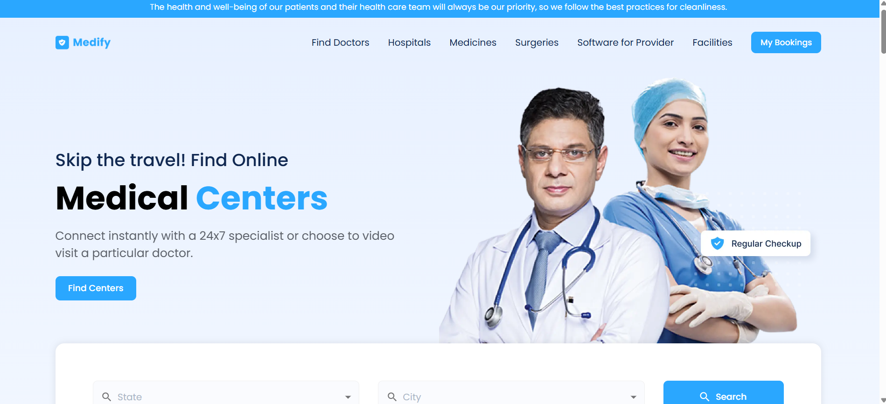

# MEDIFY - Medical Center Slot Booking Platform

## The App

**Crio Code-A-Thon Project:** React-based web application that allows users to find medical centers in a specific state and city across the USA and book appointments.

## Features:
- **Landing Page:**
    - App has top navigation bar with access to platform sections such as Find Doctors, Hospitals, Medicines, and more.
    - App hasa  search section for users to select a state and city, leading to a list of available medical centers in the chosen area.
    - Both State and City has a dropdown where the options are fetched from an api.
- **Search Results Page:**
    - Search result pages has a listings view showing available medical centers in the selected location with the option to book appointments.
- **Booking Interface:**
    - App has a detailed booking section for users to select a medical center, with a calendar-like interface to choose an appointment date.
    - Booking Interface has the ability to book an appointment within a time frame from today up to one week in advance.
    - Booking Interface has a selection of available time slots for the selected day.
- **My Bookings Page:**
    - My Bookings Page is a personalized page that displays all user bookings, including details such as the medical center's name, appointment date, and time.
- **Responsive Design:**
    - The application is fully responsive to various screen widths.

## Tech Used

`HTML`
`CSS`
`REACT JS`
`REACT ROUTER DOM`

## NPM library used to

`SWIPER`
`MATERIAL UI`
`Axios`

- <a href="https://medify-two-theta.vercel.app/" target="_blank">Click here for demo</a>

**Had fun building!** 🚀